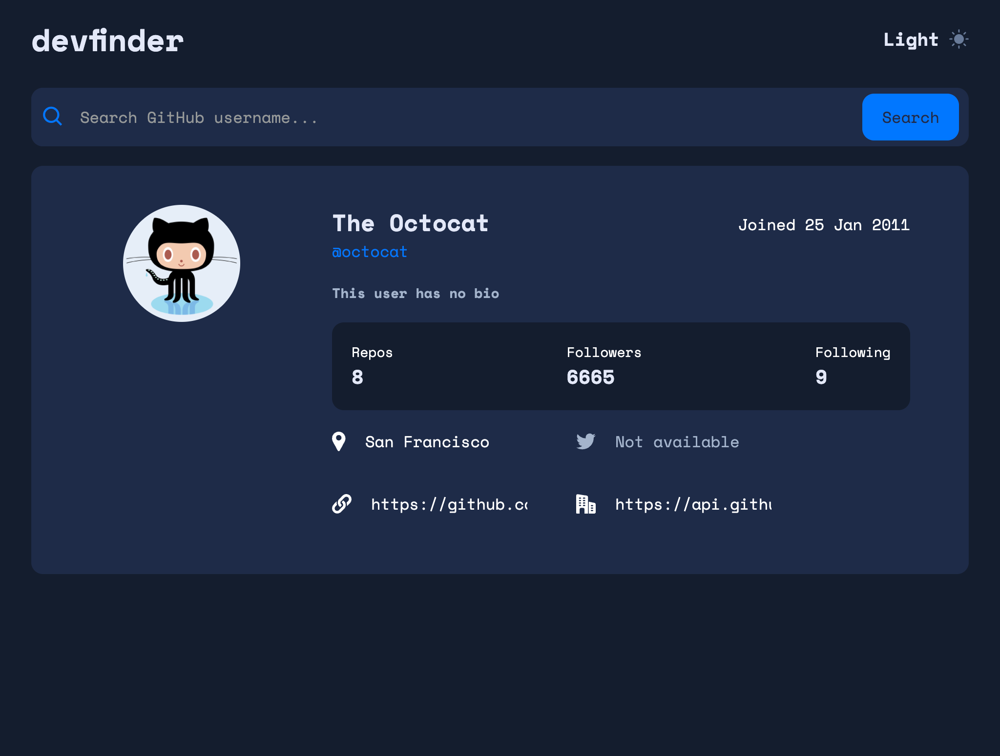

# Hey, welcome!

This is a FrontEnd Mentor challenge.
Link to the challenge: [DevFinder](https://www.frontendmentor.io/challenges/github-user-search-app-Q09YOgaH6)

### The challenge

Users should be able to:

- View the optimal layout for the app depending on their device's screen size
- See hover states for all interactive elements on the page
- Search for GitHub users by their username
- See relevant user information based on their search
- Switch between light and dark themes

### Screenshot

- Live Site URL: [https://valenss.github.io/devfinder/](https://valenss.github.io/devfinder/)

## My process

### Built with

- Semantic HTML5 markup
- CSS custom properties
- Flexbox
- [React](https://reactjs.org/) - JS library
- Date JS library
- Module styled

## Author

- Website - [Valentin Schiaffino](https://www.linkedin.com/in/valentin-schiaffino/)
